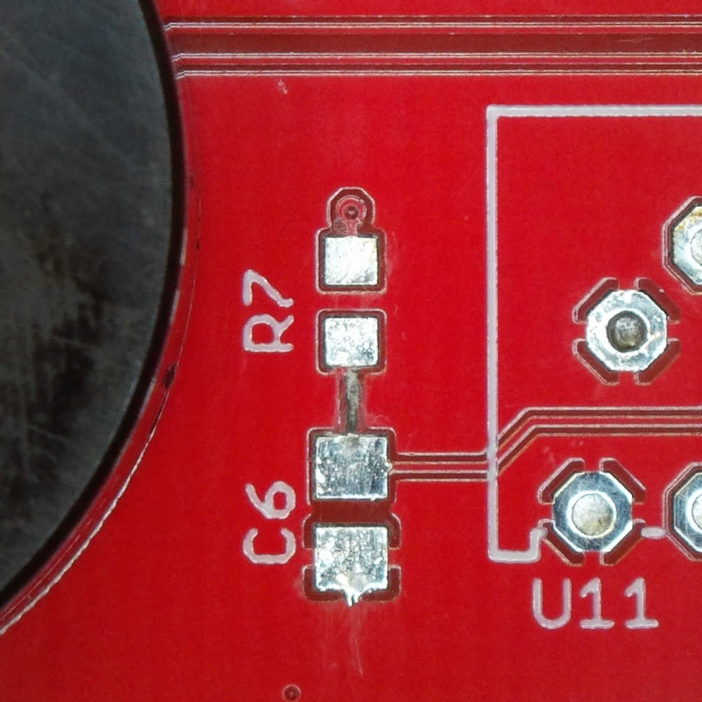
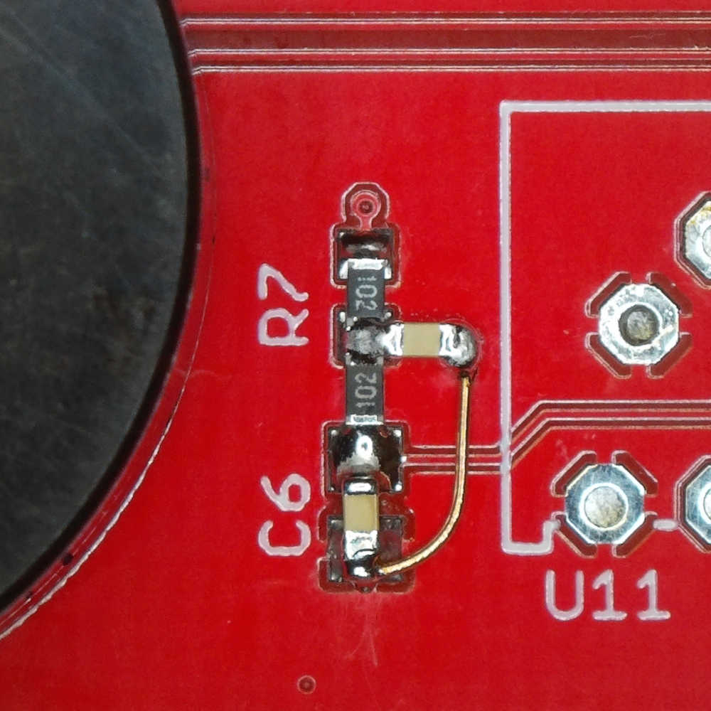

[Japanese]

# PlayWave🛠️

録音データをスピーカーで再生するサンプルコードです。

* 出力周波数は8000Hz
* 出力ビット数は8
* 録音したデータをAudacityとxxdコマンドでC言語の定数にしてコードに埋め込み

## ハードウェア改造

R7とC6を実装します。

* R7 = 1K
* C6 = 0.01u

できれば、さらにR=1KとC=0.01uを追加して2次CRフィルタにしたほうが良いです。

* R7とC6のパターンをカット
* R7 = 1K
* R7とC6の間 = 1K
* C6 = 0.01u
* R7-C6とGNDの間 = 0.01u

## 録音データの変換

1. MP3やWAV形式のファイルを[Audacity](https://www.audacityteam.org/)でモノラル化、周波数を変更する。
    * モノラル
    * プロジェクトのサンプリング周波数=8000Hz
2. Audacityでビット数を変換してバイナリファイルに保存する。（書き出し）
    * ファイルの種類: その他の非圧縮ファイル
    * ヘッダー: RAW (header-less)
    * エンコーディング: Unsigned 8-bit PCM
3. (WSLを使って)[xxdコマンド](https://manpages.ubuntu.com/manpages/focal/ja/man1/xxd.1.html)でバイナリファイルをC言語の変数にする。
    * `xxd -i (ファイル名)`
4. C言語の変数を定数にする。
    * 変数定義の先頭に`const`を追加
